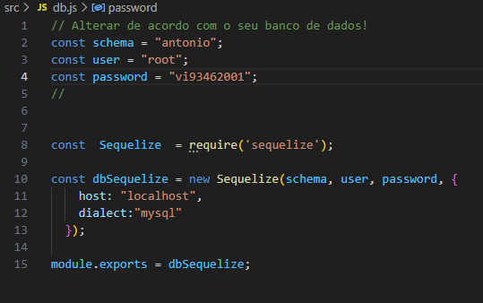
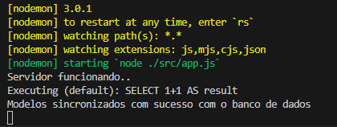

# TesteShopper Front End e Back End

### Antonio Victor Pereira Severiano

[](mailto:avps2@aluno.ifal.edu.br)
[](https://www.linkedin.com/in/antonio-victor-pereira-severiano-0aa170169/)
[](https://instagram.com/antoniovictor2k)
[](https://api.whatsapp.com/message/O4I654ATQMPYE1?autoload=1&app_absent=0)

# Passo a Passo para utilizar o Leitor de arquivo CSV

## 1º Passo

- 1.1 Clone ou baixe o zip do diretório no GitHub.
- 1.2 Abrar o Terminal e execute o comando

```
npm install
```

- 1.3 Entre na Pasta BackEnd.
- 1.4 Entre no arquivo db.js
- 1.5 Faça as modificações de acordo com seu SGBD (Mysql) nas variaveis

```
const schema = "antonio";
const user = "root";
const password = "vi93462001";
```

 Figura do passo 1.5

- 1.6 Caso ainda não tenha criada as tabelas e seus valores, execute os comandos abaixo no seu Mysql dentro do Schema escolhido

```
-- nome do seu Schema 
use seuSchema; 

CREATE TABLE products
(
	code bigint PRIMARY KEY, # CODIGO DO PRODUTO
	name varchar(100) NOT NULL, # NOME DO PRODUTO
	cost_price decimal(9,2) NOT NULL, # CUSTO DO PRODUTO
	sales_price decimal(9,2) NOT NULL # PREÇO DE VENDA DO PRODUTO
);

CREATE TABLE packs
(
  id bigint AUTO_INCREMENT PRIMARY KEY, # id primario da tabela
  pack_id bigint NOT NULL,  # id do produto pack
  product_id bigint NOT NULL, # id do produto componente
  qty bigint NOT NULL, # quantidade do produto componente no pack
  CONSTRAINT FOREIGN KEY (pack_id) REFERENCES products(code),
  CONSTRAINT FOREIGN KEY (product_id) REFERENCES products(code)
);

INSERT INTO products VALUES
(16,'AZEITE  PORTUGUÊS  EXTRA VIRGEM GALLO 500ML',18.44,20.49),
(18,'BEBIDA ENERGÉTICA VIBE 2L',8.09,8.99),
(19,'ENERGÉTICO  RED BULL ENERGY DRINK 250ML',6.56,7.29),
(20,'ENERGÉTICO RED BULL ENERGY DRINK 355ML',9.71,10.79),
(21,'BEBIDA ENERGÉTICA RED BULL RED EDITION 250ML',10.71,11.71),
(22,'ENERGÉTICO  RED BULL ENERGY DRINK SEM AÇÚCAR 250ML',6.74,7.49),
(23,'ÁGUA MINERAL BONAFONT SEM GÁS 1,5L',2.15,2.39),
(24,'FILME DE PVC WYDA 28CMX15M',3.59,3.99),
(26,'ROLO DE PAPEL ALUMÍNIO WYDA 30CMX7,5M',5.21,5.79),
(1000,'BEBIDA ENERGÉTICA VIBE 2L - 6 UNIDADES',48.54,53.94),
(1010,'KIT ROLO DE ALUMINIO + FILME PVC WYDA',8.80,9.78),
(1020,'SUPER PACK RED BULL VARIADOS - 6 UNIDADES',51.81,57.00);

INSERT INTO packs (pack_id,product_id, qty) VALUES 
(1000,18,6),
(1010,24,1),
(1010,26,1),
(1020,19,3),
(1020,21,3);


```

* 1.7 Abrar o terminal e execute o comando 
```
npm start
```
* Verifique se aparecer uma mensagem igual a da figura 1.7 

 figura 1.7
* Importante ter a Mensagem 'Servidor Funcionando...' e 'Modelos sincronizados...'


## 2º Passo

* 2.1 Entre na Pasta Front-end.
* 2.2 Abrar o terminal e execute o comando
```
npm start
```
* Você será direcionado para uma aba do navegador.

